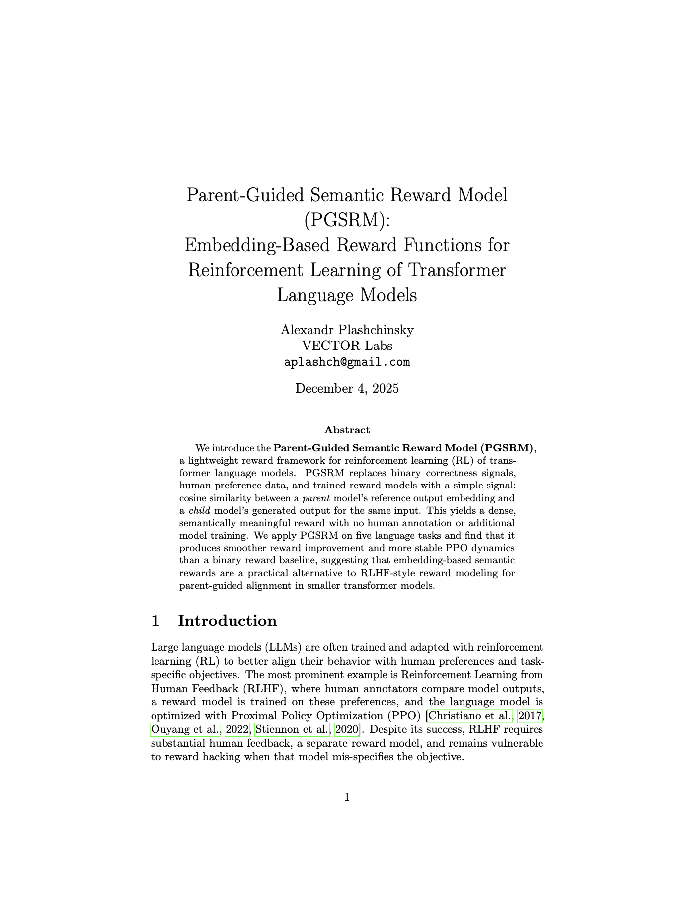

# PGSRM: Parent-Guided Semantic Reward Model  
### Reinforcement Learning Experiments with GPT-2 + Embedding-Based Reward

This repository contains the full code used for the experiments in **Parent-Guided Semantic Reward Models (PGSRM)**.  
All experiments are implemented as **stand-alone Jupyter notebooks**, with **custom PPO (from-scratch PyTorch) implementations** written directly inside each notebook.

The repo is organized by task: each task has its own folder, its own dataset of prompts, and two notebooks — one for the binary-reward baseline and one for PGSRM.

---

## 📁 Repository Structure

Each folder corresponds to a single RL task:

| Folder              | Task Name              | Description |
|---------------------|------------------------|-------------|
| `test-colors`       | Color Mixing           | Map “blue + red =” → “purple” |
| `test-opposites`    | Antonym Generation     | Map adjectives to antonyms |
| `test-categories`   | Word Categorization    | Map nouns → categories (animal, food, object…) |
| `test-copy`         | Exact String Copying   | Output the exact input string |
| `test-negative`     | Sentiment Inversion    | Flip positive → negative while preserving meaning |

Each folder contains:

- `gpt2-binary.ipynb`: **Binary reward baseline** (0 or 1 correctness)
- `gpt2-pgsrm.ipynb`: **PGSRM reward** using embedding-based semantic similarity

---

## 🚀 Running the Experiments

There is **no requirements.txt** — all dependencies are listed and installed directly inside the *first cell* of each notebook.

To run an experiment:

1. Open the notebook  
2. Run the first cell to install dependencies  
3. Run the rest of the notebook normally

Each notebook includes:

- Custom PyTorch PPO implementation (actor/critic, KL penalty, entropy, etc.)
- Reward computation (binary or embedding-based)
- All task prompts loaded from `/prompts`
- Logging (reward, entropy, KL, losses)
- Final plots and training curves

---

## 🧠 PPO Implementation

Each notebook implements **PPO from scratch**, including:

- Policy network (GPT-2 Small or Large)
- Value function head
- Unclipped surrogate loss (optional)
- Custom KL penalty schedule
- Entropy regularization
- Gradient clipping
- Training loop with 100,000 single-step episodes

There are **no external RL libraries** used — everything is implemented directly for reproducibility.

---

## 📚 Embedding Models

PGSRM uses two embedding functions:

- **Numberbatch embeddings** (for lexical tasks)
- **OpenAI `text-embedding-3-large`** (for long-sequence tasks)

These are loaded inside each notebook as needed.

---

## 🧪 Tasks Included

The repository covers **five** RL environments:

1. **Color Mixing**  
2. **Antonym Generation**  
3. **Word Categorization**  
4. **Exact String Copying**  
5. **Sentiment Inversion**

Each task is single-step (bandit-style) RL:  
prompt → model output → reward → PPO update.

---

## 🔍 Reproducibility Notes

- All prompts, hyperparameters, and models used are included in the notebooks.
- Because experiments were run on ephemeral cloud GPUs, **model checkpoints and episode logs are not included**.
- However, the full training code and all tasks can be completely re-run using the notebooks as-is.

---

## 📄 License

This code is released for research and educational use.  
Feel free to fork, modify, and build on it.

